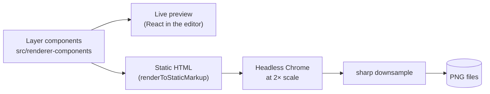

# App Store Screenshot Generator

[](https://github.com/HarmenSchouten/appstore-screenshot-generator/actions/workflows/verify.yml)
[](https://github.com/HarmenSchouten/appstore-screenshot-generator/releases)
[](LICENSE)

Design App Store and Google Play screenshots in a local visual editor, then
export store-sized PNGs for every language and platform in one click.



You build each screenshot from layers: a background, a device frame holding
your app's screen, headline text, and decoration. The editor previews it live,
and export renders the same components in headless Chrome, so the PNG matches
the preview. Everything runs on your machine; a project is a folder of JSON
and images you can back up or put in git.

## Features

- **Layers.** Background, text, phone frame, image, glow and 20 decorative
  shapes (lines, arrows, stars, blobs, dot patterns and more). Position,
  rotate, fade and drag to reorder.
- **Device frames.** iPhone 15 Pro / Pro Max, iPhone 17 Pro / Pro Max,
  Pixel 9 Pro, Galaxy S24 Ultra, OnePlus 13, and a generic frame per
  platform. Each platform has a default device that frames inherit.
- **Store formats.** iOS screenshots, Android screenshots and the Google
  Play feature graphic, each at a size the store accepts
  ([below](#store-sizes)).
- **Languages.** 34 store languages. A new language can start as a copy of
  the current one, and a platform's screenshots can be copied to the other,
  so localizing is editing text rather than rebuilding layouts.
- **Theme.** Gradient templates, a colour palette and any Google Font,
  shared by every screenshot in the project.
- **Export.** One run renders every language × platform, streams progress,
  can be cancelled, and reports failures per screenshot with the reason.
- **Projects.** Keep several side by side, and rename, duplicate or delete
  them. Every screenshot has its own URL
  (`/<project>/<lang>/<platform>/<screenshot-id>`).
- **Keyboard.** Most actions have a shortcut; press <kbd>?</kbd> for the
  list.

## Quick start

You need [Deno 2](https://docs.deno.com/runtime/getting_started/installation/)
and Google Chrome or Chromium. Node.js is not required.

```sh
git clone https://github.com/HarmenSchouten/appstore-screenshot-generator.git
cd appstore-screenshot-generator
deno install
deno task start
```

Open <http://localhost:3000>. The sample project already has an iOS
screenshot, an Android screenshot and a feature graphic, so you can press
**Generate** (top right) straight away. The PNGs land in
`projects/default/output/en/ios/` and `projects/default/output/en/android/`.

> [!NOTE]
> `deno install` warns that it ignored a build script for `npm:puppeteer`.
> That is expected: the script downloads a bundled Chrome, and this tool uses
> the Chrome already on your machine.

To make it yours: select a screenshot in the sidebar, open its phone-frame
layer and upload one of your app's screen captures into it. Add languages with
the **+** next to the language tabs.

## How it works



The layers are React components that both sides share. In the browser they
render the live preview; on export, the Deno server renders them to a static
HTML document, loads it in headless Chrome (via Puppeteer) at twice the target
size, and downsamples the capture with sharp for crisp text and edges. One
renderer means the preview and the PNG cannot drift apart.

The editor auto-saves to a small [Hono](https://hono.dev/) API, which owns the
project files and runs the export. Design notes and decision records live in
[`docs/`](docs/README.md).

## Projects and output

Each project is a folder under `projects/`:

```text
projects/
└── default/              the sample project (the only one tracked by git)
    ├── project.json      name and timestamps
    ├── config.json       theme, languages, platforms, screenshots and their layers
    ├── assets/images/    uploads from the Media Library
    └── output/
        ├── manifest.json what the last run produced, and what failed
        └── en/
            ├── ios/screenshot-1.png
            └── android/
                ├── screenshot-1.png
                └── feature-graphic.png
```

- File names come from the screenshot names (`Screenshot 1` →
  `screenshot-1.png`).
- **`output/` belongs to the generator.** Each run deletes anything in it
  that the run will not produce, so don't keep other files there.
- `.gitignore` excludes every project except `default`. Remove that rule if
  you want your projects in version control.
- `config.json` is plain JSON and fine to edit by hand, but stop the server
  first: it keeps the active project in memory and the next save from the
  editor overwrites the file.

## Store sizes

| Format | Exported at | What the store asks for |
| --- | --- | --- |
| iOS screenshot | 1242 × 2688 | Apple's 6.5" size. Apple lists 6.9" (1260 × 2736, 1290 × 2796 or 1320 × 2868) first; without 6.9" uploads, App Store Connect scales the 6.5" set. 1 to 10 per listing. [Apple specs](https://developer.apple.com/help/app-store-connect/reference/app-information/screenshot-specifications) |
| Android screenshot | 1080 × 1920 | 9:16, each side 320 to 3840 px. At least 2 to publish; at least 4 at ≥ 1080 px to be eligible for larger placements. [Google Play specs](https://support.google.com/googleplay/android-developer/answer/9866151) |
| Play feature graphic | 1024 × 500 | Fixed size, required to publish. |

Both stores reject images with an alpha channel; exports are opaque PNGs.

Canvas sizes live in `config.json` under each language's
`platforms.<ios|android>.dimensions`; the editor doesn't expose them yet. The
feature graphic is always 1024 × 500.

## Development

| Command | What it does |
| --- | --- |
| `deno task dev` | API on :3000 plus the Vite dev server with hot reload on <http://localhost:5173> |
| `deno task start` | Build the UI once and serve it together with the API on :3000 |
| `deno task test` | Unit and route tests |
| `deno task verify` | Format check, lint, type-check, tests and UI build, the same steps CI runs |

Set `PORT` to move the API (and, in `start` mode, the UI) off 3000; in dev
mode Vite proxies to the same port.

| Path | Contents |
| --- | --- |
| `src/server.ts`, `src/routes/` | Hono API: projects, config, assets, generation |
| `src/generation.ts`, `src/png-export.ts` | Export pipeline and the Chrome → PNG step |
| `src/renderer-components/` | Layer components shared by preview and export |
| `src/device-presets/` | Device frames, one object literal per device |
| `src/types/`, `src/lib/` | Shared types, store sizes, gradient and layer helpers |
| `src/ui/` | The editor: React, Zustand, TanStack Query, Tailwind |

## Troubleshooting

**"Chrome or Chromium was not found."** The exporter looks in the default
install locations for Windows, macOS and Linux. Point it at another binary
with `PUPPETEER_EXECUTABLE_PATH`:

```sh
export PUPPETEER_EXECUTABLE_PATH="/path/to/chrome"               # macOS / Linux
$env:PUPPETEER_EXECUTABLE_PATH = "C:\Path\To\chrome.exe"         # PowerShell
```

**Fonts look wrong in the PNGs.** The theme's font is fetched from Google
Fonts during export. Offline, each screenshot waits up to 5 seconds for it and
then renders with the fallback font.

**Blank editor on the first `deno task dev`.** On a fresh clone, Vite's first
dependency scan can fail with `Failed to recover TsconfigCache type from napi
value`. Stop it and run `deno task dev` again
([#138](https://github.com/HarmenSchouten/appstore-screenshot-generator/issues/138)).
`deno task start` is not affected.

**Port 3000 is taken.** `PORT=3001 deno task start` (PowerShell:
`$env:PORT = 3001; deno task start`).

## Contributing

See [CONTRIBUTING.md](CONTRIBUTING.md) for setup, the checks a PR has to pass,
and commit conventions.

## License

[MIT](LICENSE)
