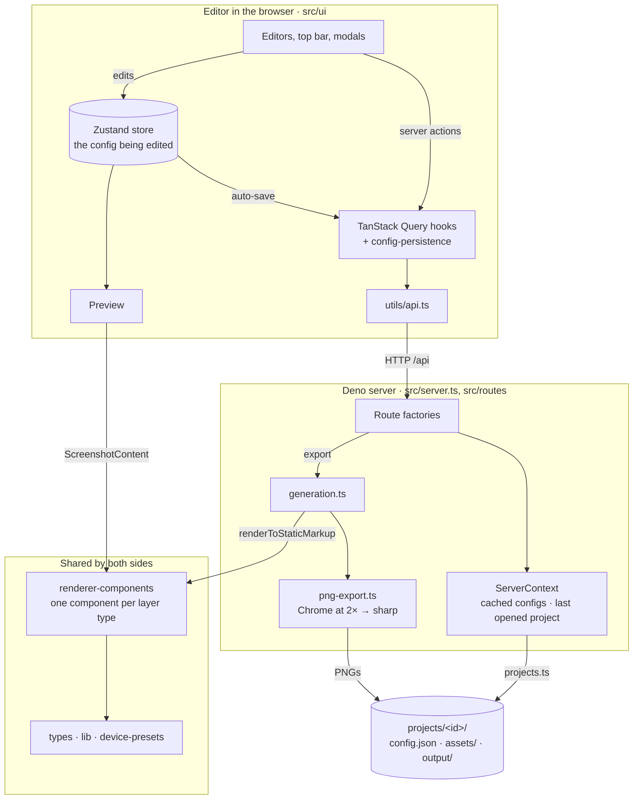

# Architecture

This is the map of the code for someone about to change it. The
[README](../README.md) covers what the tool does and how to run it; this file
covers where things live, how they talk to each other, and the rules the code
relies on. It names modules and types rather than linking them: use symbol
search to jump to them.

Only things that change rarely belong here. If a sentence goes stale, fix it
or delete it.

## Bird's eye view

A project is a folder of JSON and images. The editor, a React app, loads one
project's config, lets you edit it, and auto-saves it to a Deno server. On
export, the server renders every screenshot in the config to an HTML document
with the **same React components** the editor previews with, screenshots each
document in headless Chrome at 2× and downsamples the result to a PNG.



## Codemap

### Shared by server and editor

- **`src/types/`** (`@app-types`): the data model. `ProjectConfig` →
  `LanguageConfig` → `PlatformConfig` (dimensions + screenshots) →
  `Screenshot` (role + layers) → `Layer`, a discriminated union on `type`:
  `background`, `text`, `phone-frame`, `image`, `glow`, `shape`. Shapes are a
  second union, discriminated on `shapeType` into families.
- **`src/lib/`** (`@lib`): helpers that depend on nothing but `types`.
  `index.ts` has platforms, store sizes (`DEFAULT_DIMENSIONS`,
  `FEATURE_GRAPHIC_SIZE`, `getScreenshotDimensions`) and `assertNever`;
  `layers.ts` has the defaults every layer type falls back to
  (`LAYER_DEFAULTS`, `SHAPE_DEFAULTS`, `withDefaults`, `resolveShape`) and
  shape metadata; `gradient.ts` builds, parses and matches gradient CSS.
- **`src/device-presets/`** (`@device-presets`): device frames as data.
  `presets.ts` holds one object literal per device; `define.ts` holds the
  builders that fill in what a device family shares; `index.ts` is the
  registry and the per-platform defaults. `DevicePresetId` is derived from the
  literals.
- **`src/renderer-components/`** (`@renderer/`): the renderer.
  `Screenshot.tsx` has `ScreenshotContent` (the layers, used by the preview)
  and `Screenshot` (a full HTML document, used by export); `layers/` has one
  component per layer type, positioned by `PositionedLayer`; `BaseStyles.tsx`
  is the CSS both documents share; `server.ts` is `renderScreenshot`, the
  `renderToStaticMarkup` call.

### Server

- **`src/server.ts`**: composes the Hono app, answers `GET /api/init` (the
  editor's first call) itself, serves `dist/` when a build exists, and shuts
  Chrome down with the process.
- **`src/routes/`** (`@routes`): one factory per area (`projects`, `config`,
  `assets`, `generate`, `output`). Everything inside a project is mounted
  under its id (`/api/projects/:projectId/…`, `/assets/:projectId/`,
  `/output/:projectId/`). The factories that read or write a config take the
  `ServerContext` from `context.ts`. `http.ts` has the JSON error
  handlers, the body validators, and `projectIdOf` / `requireProject`.
- **`src/projects.ts`**: everything that touches a project folder: create,
  load, save, rename, duplicate, delete, and `normalizeProjectConfig`.
- **`src/generation.ts`**: the export run. `planGeneration` decides every
  output file up front, `pruneOutputDir` deletes the rest, `generateAll` loops
  and writes `output/manifest.json`. The HTML → PNG step is injected, so
  tests run without Chrome.
- **`src/png-export.ts`**: that HTML → PNG step: a shared Puppeteer browser,
  a bounded wait for web fonts, and sharp.
- **`src/errors.ts`**, **`src/path-safety.ts`**: `HttpError` subclasses and
  `resolveInside`.

### Editor (`src/ui/`)

- **`main.tsx`**, **`components/App.tsx`**: providers, the loading gate, and
  the layout.
- **`store/`**: one Zustand store, one `AppState` interface in `types.ts`.
  Screenshot actions live in `screenshots.ts`.
- **`hooks/`** (`@hooks`): one file per domain (`projects`, `config`,
  `languages`, `assets`, `generation`, `routing`, `screenshots`, `layers`,
  `hotkeys`). `shortcut-definitions.ts` is the one table of keyboard
  shortcuts. Components import from `@hooks`; hooks import each other by
  relative path.
- **`utils/`**: `api.ts` (every HTTP call), `route-selection.ts` (URL ⇄
  selection), `config-persistence.ts` + `auto-saver.ts` (auto-save),
  `switch-guard.ts` (overlapping project switches), `query.ts` (the
  `QueryClient` and query keys).
- **`components/`**: `Preview.tsx` mounts the renderer; `editors/` has one
  editor per layer type; `modals/`, `TopBar/`, `inputs/` and `primitives/`
  (`Modal`, `ConfirmBar`, `Sortable`) are what they say.

## Boundaries

- **The server and the editor share exactly four directories**: `types`,
  `lib`, `device-presets` and `renderer-components`. Nothing under `src/ui`
  imports a server module, and no server module imports `src/ui`. Tests are
  the exception: they borrow `getDefaultConfig` and `src/test-helpers.ts` for
  fixtures, here and in the rule below.
- **The HTTP API is the only channel between them.** `src/ui/utils/api.ts`
  is the only file that calls it. Every call rejects on a non-2xx status with
  the server's `{ error }` message, except `fetchGenerated`, which treats any
  failure as "no previous run".
- **The shared directories depend on nothing else in `src`.**
  `renderer-components` imports `lib`, `device-presets` and `types`; `lib`
  and `device-presets` import only `types`; `types` imports `DevicePresetId`
  back from `device-presets` as a type only, so the cycle is erased at
  runtime.

## Cross-cutting concerns

### Where state lives

| State | Owner | Why there |
| --- | --- | --- |
| Project, language, platform, selected screenshot | The URL: `/<project>/<lang>/<platform>/<screenshot-id>` | Deep links and back/forward work without syncing two copies |
| The config being edited, and which project it belongs to | Zustand (`config`, `_configDirty`, `currentProject`) | Store actions need the config synchronously to clone and edit; `subscribe` drives auto-save |
| Modal, overlays, toasts, export progress | Zustand | Client-only |
| Asset list, last export's results, init payload | TanStack Query cache | Fetched data with loading and error states |
| Each project's config on the server, and the project opened last | `ServerContext` | Routes that edit a config in place share one copy; `/api/init` opens the last project |

`currentProject` is the project whose config the store holds, which is not
always the one the URL names: while a switch is in flight they differ. Every
request about a project's contents carries that id.

`useSelection()` resolves the URL against the loaded config on every render.
Besides navigation the user starts, two places write the URL.
`useRouteReconciler()`, mounted once in `App`, canonicalises a path that
resolved to something else and loads a project the URL names but the store
does not hold. `useSwitchProject` puts the URL on the
new project when a switch lands, or back on the loaded one when it fails.

### Saving the config

The editor saves the whole config with `PUT /api/projects/<id>/config`. There
is one auto-saver per project, and each saves only to its own project. Local
edits and server loads take different paths into the store, so a load never
saves itself back:

```mermaid
sequenceDiagram
    participant C as Component
    participant S as Zustand store
    participant P as config-persistence
    participant H as Mutation hook
    participant API as Server

    Note over C,API: Local edit (layer slider, add screenshot, theme save)
    C->>S: store action → updateConfig(config)
    S->>S: config, _configDirty = true
    S-->>P: subscriber sees a dirty change
    P->>P: debounce 50 ms
    P->>API: PUT /api/projects/:id/config
    API-->>P: 200
    P->>S: _configDirty = false
    Note over P,API: on failure: retry after 1, 2, 4, 4… s, one error toast per streak, one toast on recovery. A 4xx is not retried; the next edit tries again

    Note over C,API: Server-side edit (add language, copy platform, export)
    C->>H: mutate()
    H->>P: flushPersist(id)
    P->>API: PUT /api/projects/:id/config (only if an edit is pending)
    H->>API: the operation itself
    API-->>H: result
    H->>S: setState, leaving _configDirty false (skipped if the editor left the project)
    Note over S,P: not dirty, so nothing is saved back
```

A project switch doesn't flush the project it leaves: an edit still waiting
belongs to that project, and its saver still saves it there. It does flush
the project it opens, so an edit left waiting from an earlier visit reaches
the server before that project's config is read back.

The per-screenshot routes under `/api/projects/<id>/config/screenshot/…`
exist on the server but the editor does not use them.

### Export

`POST /api/projects/<id>/generate/stream` runs `generateAll` and streams its
progress as server-sent events. Closing the stream cancels the run after the
screenshot in progress. A failed screenshot is recorded with its reason and the
run carries on. `GET /api/projects/<id>/generate/generated` reads the manifest;
nothing infers results from the files on disk.

### Dev and start mode

`deno task dev` runs the API on `PORT` (3000) and Vite on 5173; Vite proxies
`/api`, `/assets` and `/output` to the API. `deno task start` builds the UI
into `dist/` and the API serves it with an SPA fallback, so deep links load
the editor. `server.ts` picks the mode by whether `dist/index.html` exists.

### Tooling

Deno owns the dependencies: `package.json` is the npm manifest, `deno.lock`
the only lockfile, and tasks call tools from `node_modules/` through Deno.
Node is not needed. Import aliases are declared once, in `deno.json`
`imports`; `vite.config.ts` derives the UI build's aliases from it. There is
no `tsconfig.json`. An import that leaves its own directory uses an alias,
never `../`. Tests sit next to the code they cover as `*_test.ts` and run
under `deno test`. There is no browser or React test harness, so editor logic
worth testing goes in a plain `.ts` module rather than a component.

## Invariants

Each of these is true of `main`. Where one has a *Why*, it records the options
that were considered and rejected, so they don't need proposing again without
new information. The PR numbers point to where a rule was decided or last
reshaped; some rules are older than the PR cited.

**One renderer.** `src/renderer-components` is the only code that turns a
screenshot into markup; the preview mounts `ScreenshotContent`, export wraps
it in `Screenshot` and `renderToStaticMarkup`. It imports only React,
`@app-types`, `@lib` and `@device-presets`, and uses no browser or Deno
globals. *Why:* the preview and the PNG cannot drift apart. The iframe of
server-rendered HTML it replaced flickered on every edit; a postMessage bridge
or a canvas preview would each have meant a second renderer. (#1)

**Export is deterministic.** The export document renders with animations off
(`animate={false}`), gets a bounded time to load (15 s, including the Google
Fonts stylesheet) and then to settle its fonts (5 s), and is captured at 2×
then downsampled. *Why:* a PNG must not depend on when Chrome happened to take
it. (#123, #133)

**A screenshot is an ordered list of layers, and list order is paint order.**
There is no `zIndex`. Every positioned layer is centred on `posX`/`posY`
percent of the canvas and rotated in degrees; the background layer always
fills the canvas. The Play feature graphic is a `Screenshot` with
`role: "feature-graphic"`, not a separate type. *Why:* one positioning model
for every element and one code path for both roles. Fixed layout slots,
layout templates and a hybrid "simple mode" were rejected: each new layout
would have meant new fields or a second code path. (#14)

**The background follows the theme live.** A background layer with neither
`gradient` nor `colors` renders `theme.background.gradient` at render time, so
a theme change recolours every such screenshot. The theme gradient itself is
a CSS string: the theme editor matches it against the gradient templates
(`matchGradientTemplate`) or keeps it as custom CSS. Customising one layer's
background copies the theme gradient into that layer, split into editable
parts by `parseGradientCSS` when they would reproduce it exactly and kept as
raw CSS otherwise; from then on that layer no longer follows the theme.
*Why:* a structured theme gradient would have lost any CSS the builder can't
produce. (#125)

**Canvas size comes from one function.** `getScreenshotDimensions` gives a
screenshot its platform's `dimensions`, or 1024 × 500 for a feature graphic,
and both the preview and export call it. *Why:* frame geometry scales with
canvas width, so a preview at another width drew frames at a different size
than the PNG. (#108)

**Device frames are data.** A device is one object literal in
`device-presets/presets.ts`; its geometry is normalised to a 400 px reference
width (`DEVICE_PRESET_REFERENCE_WIDTH`) and drawn with CSS and SVG, with no bitmaps,
logos or vendor artwork. A phone-frame layer with no `model` renders its
platform's default (`platformDefaults.<platform>.defaultDevicePresetId`).
*Why:* a consistent frame across a platform's set is the common case, and one
device per project can't fit both iOS and Android. Parametric geometry scales
to any canvas and keeps copyrighted renders out of the repository. (#116,
#134)

**The URL is the single source of truth for the selection.** The store holds
no selected language, platform or screenshot, and no requested project; store
actions take the `{ lang, platform }` they act on. `route-selection.ts` is the one place path
segments are validated, and it is pure. *Why:* a store copy needed a sync in
each direction, and the back/forward one kept losing races. (#135)

**The store never calls the API.** Auto-save is the plain module
`config-persistence.ts`; every other server call goes through a TanStack Query
hook, which updates the store when it succeeds. The config being edited lives
in Zustand; the `init` query keeps the copy it first loaded but never refetches
it. *Why:* store actions need the config synchronously, and Zustand's
`subscribe` drives auto-save without routing every edit through a mutation.
(#29, #129)

**Local edits and server loads are different operations.** `updateConfig`
marks the config dirty and gets saved; `hydrate` marks it clean and does not.
A mutation that has the server read or rewrite the open project's config calls
`flushPersist()` first, so the server never works from a stale copy: opening
a project, add or delete language, copy platform, export, rename and
duplicate do. Deleting a project drops its pending edit instead. A rename
also changes the name inside the config, so the store takes the new name
into the open project's config as a local edit and saves it. *Why:* marking
it clean like a load would leave the old name on the server whenever an edit
saved during the rename landed after it. (#141)

**Everything inside a project is addressed by its id.** Config, asset and
export routes live under `/api/projects/:projectId/`, and files are served
from `/assets/:projectId/` and `/output/:projectId/`. The editor sends the
id of the project whose config it holds, read once when an action starts, and
ignores a server-side edit that answers after it has moved to another
project. An export records its project, so its results keep pointing at that
project's output. The server has no active
project; `ServerContext` only remembers the last one opened, for
`/api/init`. A request for a project that no longer exists is a 404 and
creates nothing, and the auto-saver does not retry it. *Why:* with one active
project on the server, a config save didn't name its project, so two tabs on
different projects, two switches answered out of order, or an edit made
during a switch could save one project's config into another. Checking the
id against a single active project and answering 409 was rejected: it stops
the overwrite, but two tabs still take the active project from each other,
and any second client has to move the editor's project to touch its own.
(#136)

**Every config is normalised on load and save.** `normalizeProjectConfig`
guarantees both platforms exist for every language, platform default devices
are valid ids, and every layer has an id; a load that changes the file writes
it back once. Server code relies on this and does not re-check. (#122, #126)

**Paths in API requests go through one chokepoint each.** Project ids must be
slugs, checked in `getProjectDir`; asset and output paths in a request are
resolved with `resolveInside`, which refuses anything outside its base
directory. *Why:* these values reach `Deno.remove`. (#122) Layer `imagePath`
values inside a saved config are not checked; export resolves them against
the assets folder's `file://` URL.

**The generator owns `output/`.** Each run deletes whatever it will not
produce and records what it did produce in `manifest.json`. Don't keep other
files there.
