# Config Persistence — Sequence Diagram

How config changes flow from user actions through the Zustand store, the `useConfigAutoSave` hook, React Query, and the server API.

- **`setConfig`** = hydration (server → store, no save triggered)
- **`updateConfig`** = local edit (triggers debounced auto-save)

```mermaid
sequenceDiagram
    participant U as User Action
    participant C as Component
    participant Z as Zustand Store
    participant H as useConfigAutoSave
    participant RQ as React Query Mutation
    participant API as Server API

    Note over Z: setConfig = hydration (no save)<br/>updateConfig = local edit (triggers save)

    rect rgb(30, 40, 60)
    Note right of U: Local Edit (e.g. add screenshot)
    U->>C: click "Add Screenshot"
    C->>Z: addScreenshot() → updateConfig()
    Z->>Z: set({ config, _configDirty: true })
    Z-->>H: subscribe fires (dirty = true)
    H->>H: debounce 50ms
    H->>RQ: mutateAsync(config)
    RQ->>API: PUT /api/config
    API-->>RQ: 200 OK
    H->>Z: setState({ _configDirty: false })
    end

    rect rgb(20, 50, 40)
    Note right of U: Theme Editor Save
    U->>C: click "Save" in ThemeEditorModal
    C->>Z: updateConfig(newConfig)
    Z->>Z: set({ config, _configDirty: true })
    Z-->>H: subscribe fires (dirty = true)
    H->>H: debounce 50ms
    H->>RQ: mutateAsync(config)
    RQ->>API: PUT /api/config
    API-->>RQ: 200 OK
    H->>Z: setState({ _configDirty: false })
    end

    rect rgb(50, 30, 30)
    Note right of U: Hydration (e.g. switch project)
    U->>C: select project
    C->>RQ: useSwitchProject.mutate()
    RQ->>H: flushPersist() (drain pending)
    H-->>RQ: flushed
    RQ->>API: PUT /api/projects/:id/activate
    API-->>RQ: { config }
    RQ->>Z: setConfig(config)
    Z->>Z: set({ config, _configDirty: false })
    Z-->>H: subscribe fires (dirty = false)
    H->>H: skip — not dirty
    end

    rect rgb(40, 30, 50)
    Note right of U: Generate All
    U->>C: click "Generate"
    C->>Z: generateAll()
    Z->>H: flushPersist()
    H->>RQ: mutateAsync(pending) if any
    RQ->>API: PUT /api/config
    API-->>RQ: 200 OK
    H-->>Z: flushed
    Z->>API: POST /api/generate/stream
    API-->>Z: SSE progress events
    end
```

